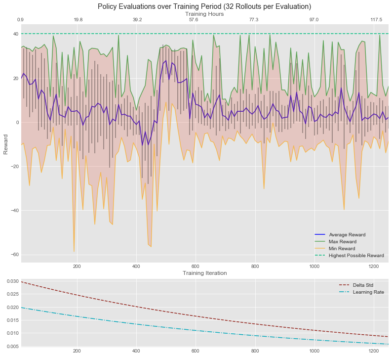

#### Project Links:
- [Blog Post](https://natecibik.medium.com/training-autonomous-vehicles-using-augmented-random-search-in-carla-19fcbe62b697) - Summarizes the research, methodology, and conclusions of this study.
- [Non-technical Presentation](https://youtu.be/ILbmBa5MAtI) - Presents the business insights gained from this study for a non-technical audience.

# Training Autonomous Vehicles using ARS in Carla

This repository offers a learning framework for training self-driving cars in the [Carla simulator](https://carla.org/) using [Augmented Random Search (ARS)](https://arxiv.org/pdf/1803.07055.pdf), as well as a study of the first implementation of this learning framework. ARS is an exciting new algorithm in the field of Reinforcement Learning (RL) which has been shown to produce competitive to superior results on benchmark MuJoCo tasks, while offering at least 15x computational efficiency in comparison to other model-free learning methods. This study sought to investigate the application of this algorithm in the context of autonomous vehicles using Carla as a training environment. Below, we can see the math behind the ARS algorithm.


For an initial investigation into using ARS to train a self-driving car policy, an attempt was made to train the agent to perform the simple task of driving through empty streets without hitting anything using only the input from a single front-facing RGB camera. This RGB camera data was converted to more generalized edge-case representations by first passing it through a pre-trained VGG19 CNN on its way into the ARS perceptron layer, as shown below:


Below is a graphic summarizing the results of the training period of this study, which was just over 5 days (121.43 hours). Learning rate and delta std decay was applied, so the changing values of these hyperparameters over time is shown.



The results of this study were inconclusive in demonstrating the ability of ARS to train a self-driving car policy. We can see from the above chart that after 1250 training iterations, substantial progress was not made in the average rewards of each evaluation step. There does appear to be a reduction in standard deviation of rewards over time, but without the desired increase in average reward. There is a slow decline in average reward in the early period of the training, then a spike upwards around 500 training iterations, after which there is another decline. This may be an indication that the learning rate is set too high for this task. It may also be an indication that the delta std was set too high as well. More testing with different hyperparameter values, tweaking of the reward system, and longer duration of training is warranted. Several insights about how to improve these results in the future were obtained, and are covered in detail in the [third notebook](notebook3_results_analysis.ipynb). The learning framework created in this repository can be used to facilitate these future investigations. 

One important point of consideration is that workers were spawned in random locations for each episode, and it is likely that this led to unfair comparisons of the rewards produced by the positive and negative additions of each delta used to make each update step, causing less meaningful alterations to the policy weights. Starting a worker in the same location for the positive and negative addition of a given delta to the weights would be a great start for fixing this issue. In future work, it would also be better to include more rollouts in each policy evaluation step, since this would evaluate the current state of the policy on a wider array of random starting positions and give a more generalized perspective on its performance by reducing the influence of luck on the policy evaluation process. This would increase the amount of time needed for training, which is already quite large, so in the future training should be scaled up onto bigger hardware, using more parallel workers and thus reducing the time required to make each update step.

The task at hand in this study was relatively simple for this domain: drive around empty streets without smashing into anything, using edge depictions generated by a CNN from RGB camera sensor input. In reality, there are many individual tasks within the context of autonomous driving that researchers seek to accomplish using machine learning and sensory input, including object detection/classification, determination of drivable area, trajectory planning, localization, and many more. The ARS algorithm is used to train agents to perform continuous control locomotion tasks using a single-layer perceptron on a given set of inputs, and it is likely that this capability would be facilitated by including among these inputs the predictions of models pre-trained to perform these specific driving-related tasks, and more research is warranted to explore such possible input configurations to the algorithm.

The safety and scalability of learning in a simulated environment such as Carla provides the opportunity to asses the potential of various combinations of learning algorithms and sensory input configurations to perform a given task or set of tasks. Once models are trained to effectively perform these individual tasks using the sensor data, their outputs may then be combined and passed as inputs into RL algorithms such as ARS to train autonomous navigation policies. The computational simplicity of ARS makes it possible to perform more simultaneous virtual training operations using a given set of inputs for any given amount of available computational resources, allowing for the efficacy of an input schema to be evaluated in a timely fashion. This means that ARS has the potential to expedite the discovery of powerful ways to combine the outputs of task-specific models to facilitate policy training. The learning framework constructed in this study can offer future researchers a structural foundation on which to explore these possibilities.


## Contents
- [notebook1_research](./notebook1_research.ipynb) - contains the abstract for this study, and presents a concise review of the research which made it possible. The notebook offers an intuitive explanation of the math behind the learning algorithm, and provides a basic coding framework of the process which makes it easy to understand the mechanics involved in training the agent, built off of the [ARS framework provided by Colin Skow](https://github.com/colinskow/move37/tree/master/ars). 

- [notebook2_train_agent](./notebook2_train_agent.ipynb) - offers guidance on how to get a parallelized training session started using the code in the '[ARS_Carla/](ARS_Carla/)' folder.

- [notebook3_results_analysis](./notebook3_results_analysis.ipynb) - reviews and analyzes the results of the 5-day training period of this study, then draws conclusions and lays out what steps should be taken in future research using the training framework.

- [ARS_Carla/](./ARS_Carla) - contains a modified version of the code provided by the authors of the 2018 paper on ARS (Mania, Guy, and Recht) to reproduce their results using the environments in Python's gym module, which employs parallelization through use of the [Ray package](https://docs.ray.io/en/latest/) for Python. Their code has been modified to make use of [Sentdex's CarEnv class](https://pythonprogramming.net/reinforcement-learning-self-driving-autonomous-cars-carla-python/) that he used to train a Deep Q-Learning Network (DQN), which itself has been modified to function in the context of ARS learning. Useful functionality has been added to the ARS code which allows the user to send in a previously trained policy so that training may be resumed at a later time or recovered in the event of an error.

- [ars_practice](./ars_practice.ipynb) - contains preliminary research into the ARS algorithm that was done by recreating Skow's ARS example using the BipedalWalker-v3 environment from Python's Gym module. This experiment was helpful to get a baseline concept of how many training episodes the algorithm needed to effectively train an agent. Videos of the resulting policy can be found in the '[videos](videos/)' folder.


## Training an Agent from Scratch
(The instuctions below apply to Windows 10, but should be similar for other OS. For more detailed discussion of the steps taken below, see the 'train_agent.ipynb' notebook in this repository.)

To see the learning algorithm in action on the task of driving through the empty streets of Carla, you will first need to have Carla installed, as well as Ray, Tensorflow, and OpenCV packages for Python.

To install Carla, simply download the release suitable for your operating system, and unzip the folder to your desired location. The executable file is in this unzipped folder, no additional installation is required. Launching this application will start a Carla server on your machine.

If you have CuDNN installed alongside TensorFlow, it will cause errors with this code. The only way to avoid this issue (that I have found so far) is to temporarily move or change the name of the folder containing your CuDNN installation so that python can not find it when loading TensorFlow. An experimental feature is in development to use this code with CuDNN by passing '--enable_gpu True' on execution, but it is buggy and I do not recommend using it. I strongly recommend that users who have CuDNN installed simply change the name of the containing folder temporarily while using this code, that is the easiest and most stable solution.

Once you have the dependencies installed, from a *non-administrator* terminal (Windows Powershell works), start a Ray cluster by typing the following command (note that you may need to adjust parameters for this command to suit the hardware of your machine, which you can inspect by calling 'ray start --help'. Running the command with no additional parameters will automatically set the number of CPUs, GPUs, and memory reserves based on your machine):

To install Ray execute:
``` 
pip install ray
```
For more information on Ray see http://ray.readthedocs.io/en/latest/. 

```
ray start --head
```

Once the cluster is successfully started, start Carla, then open a separate non-administrator terminal, navigate to the 'ARS/' folder in this repository, and enter the following command (parameters are shown being set for demonstration. Note that the --dir_path you set will contain the log file and policy file related to your training session, and will be created if it does not exist):

```
python code/ars.py --n_iter 1000 --n_workers 4 --num_deltas 32 --deltas_used 16 --learning_rate 0.02 --lr_decay 0.001 --delta_std 0.03 --std_decay 0.001 --show_cam 1 --seed 42 --eval_rollouts 100 --dir_path ./data/old_logs/2020-12-17_1000steps
```

This will connect to the running Ray cluster, and begin creating workers in the Carla server. The policy will be saved and training details logged every 10 iterations by default into the --dir_path that you set (defaults to ./data if not set).


## Training a Pre-Existing Policy
As above, you will need to start the Ray cluster and Carla server, then run a similar command as above, except you will include the --policy_file parameter, which points to the .csv or .npz file which contains the weights you are going to build on. (The default name of a saved policy file is 'lin_policy_plus.npz'. Note that this does not automatically recover the current learning rate or delta std from when the training ended, so you will need either recover that from the log file, or start it wherever you want.)

```
python code/ars.py --policy_file ./data/old_logs/2020-12-17_1000steps/lin_policy_plus.npz
```